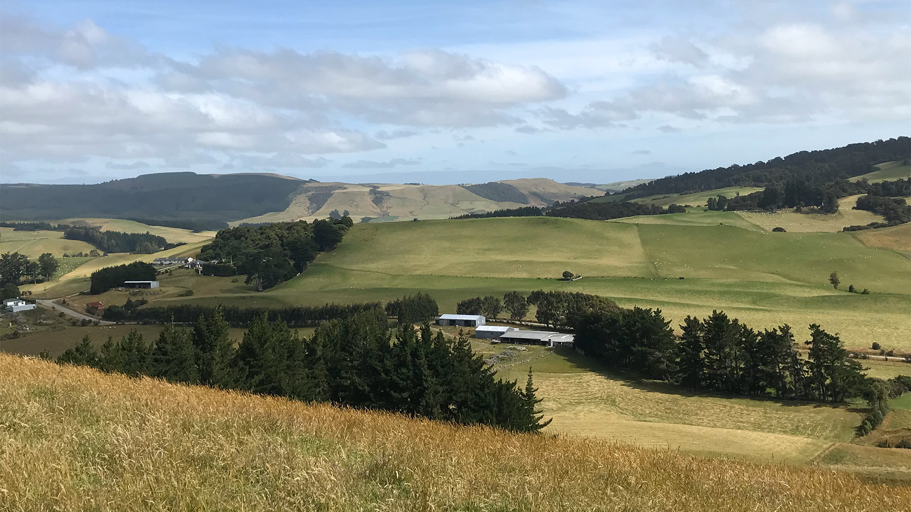
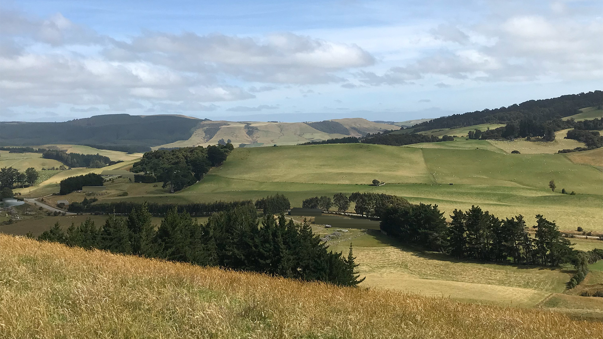
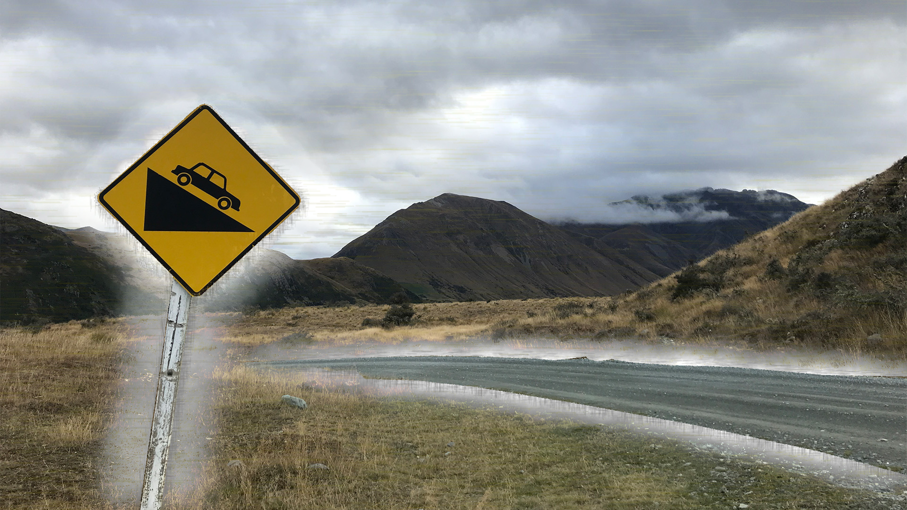
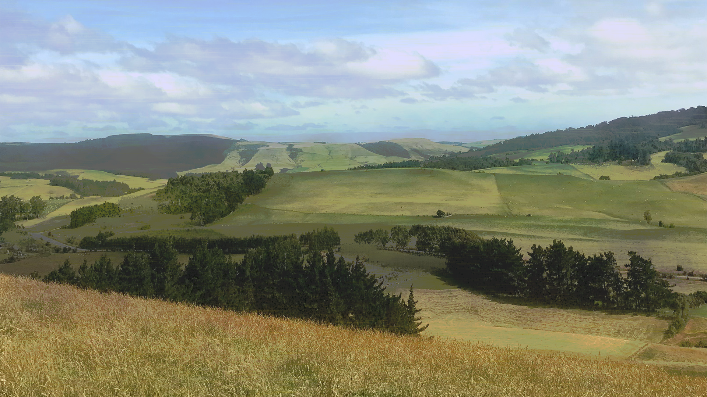

### Creative Coding 2: Custom Pixel
### Rita Close | MDDN242 Project 3 | Trimester 2 
# Natural Reversion
#### A filter investigating how landscapes would look without manmade objects and highlighting the fact that although we can try, our impact on the natural world cannot be undone.

### Design Process
I actually began my design process looking at boquets of flowers and began my first experiments with the ai highlighting certain flowers and bringing them out of the background. Although this concept was aesthetically pleasing, especially with the concepts concerning pointalism, I felt as though I could try and extend myself further than simply highlighting objects in the photos.

It was at this point where I had the idea of removing things entirely, rather than bringing them to the attention of the viewer. I actually think this idea would look cool if run in reverse, where the screen starts with the 'cover-up' mask in place and then the real photo was slowly revealed. I started off with landscae images containing cars and objects, and while this theme was interesting and surprisingly easily picked up by the ai, I also wanted to see how far it could be extended and felt it could be interesting to lean into the symbolic nature of removing something more permanent from an image. Like buildings.
##### Original Image

Anyway, from that point the first thing I tried was to take the average colour of each row and place it in the place of the masks - which worked particularly well (once I actually got it working) with landscape photos from central Otago because there isn't much contrast in the landscape and the sky is the same way, the non-diverse colour pallette helped quite a bit.
##### First Pass

The problem with this system is that I was creating the average colour by collecting the pixel colours in an array as the image was drawn. This was an issue because the average changed as the row progressed and if the mask was too close to the left of the screen, it was not blended as well as on the right.

To cover up this issue, I first tried using mostly transparent circles with varying blend modes to try and not only disrupt the colours within the mask, but also try to blur the edges between the mask and the rest of the image. This worked somewhat, but I couldn't quite balance out the colours due to the unpredictable nature of the overlapping circles, and the built up transparency they created.
Eventually I ended up adding a third draw layer in between the original image and the circles on top that would use the pixel colour final averages from the first image, but by jittering their placement would create a more hopefully more organic look.
##### Second Pass

### Experimentation
In later experiments I tried changing the different colour channels to bring out the landscape colours more, such as adding saturation or using maps to mess around with the amount of green in the photo. Ultimately, I felt that this conflicted too much with the concept of my theme and couldn't get it to look as professional as I'd hoped.

In between working to make the mask sections of the image dissapear, I got sidetracked a bit working with different blend modes, and spent a bit of time trying to create a way to better merge the masks and the base image together. I ended up stumbling upon a really cool looking halo effect - especailly when after it was drawn, the original image was put back on top. But unfortunately the point of my concept is to make things go away, not highlight where they are.

### Why This Hill to Die On
The images I have used in this project have been taken by me over the years of both my family farm, and one which my sister works at. This wasn't intended as a slight on them personally or one focussed on farming, they were just the landscape images I had on hand. The true point of it is the lasting impacts of infrastructure on New Zealand landscapes and the enduring legacy of the human race. Not necessarily in a good way. But more than a comment on society, this image filter is rather supposed to provide a glimpse into a more natural New Zealand and a nod to the past before it was touched by civilisation. It's easy to take a landscape photo in New Zealand without infrastructure, people, or manmade objects of course - I did have to sift through a few to actually find some that did contain them - but the point isn't that the need of the filter could be avoided entirely, it's that even if you don't see it at first glance - you still _know_ there's something wrong with the picture, and realise upon further inspection that something has been covered up. Perhaps it is a comment on society after all.
##### Final Result
